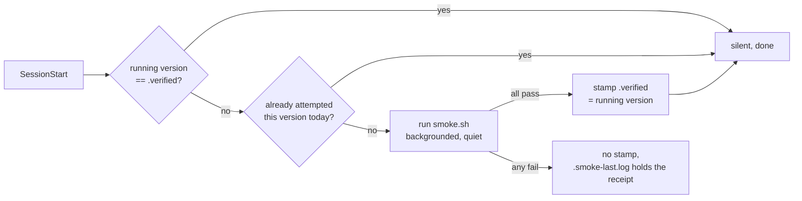

# Design: knowing whether the kit still works

> **This is a decision record, not a user guide.** It is dense on purpose: it exists so that
> future changes know what they would be overturning. For how the kit behaves day to day, read
> [FLOWS.md](FLOWS.md). For setup, the README.

    Status:            Implemented
    Last revised:      2026-08-12
    Verified against:  Claude Code 2.1.222
    Supersedes:        docs/DESIGN.md, split by feature 2026-08-12

Everything here answers one question: when the kit stops working, how do you find out? Its
healthy state is silence, which is exactly what makes a broken state hard to notice.

## D1. A blocked feature records why, and says so once a day

The background work fails quiet, because a hook cannot tell a machine that skips a feature from
one that is broken, and a warning at every session start becomes noise you learn to ignore.

**Quiet alone was not enough.** A miner that could not find the `claude` binary (O4) used to
exit before writing even a log line, so months of no proposals looked exactly like months of nothing worth saving.

Now each feature records the reason it could not run, a notice fires once a day only after the
block has lasted three days (`MEMORY_KIT_HEALTH_GRACE`, a knob because the right grace period
depends on how often you open a session), and any successful run clears its own record, so a
fixed machine goes quiet without anyone dismissing anything.

`MEMORY_KIT_NO_MINER=1` skips the miner deliberately, which is what makes every other silence a
fault worth reporting.

## D2. Two suites with opposite premises

`tests/run.sh` is the gate: fixtures in throwaway directories, runs everywhere, asserts exact
outcomes. **It can only confirm what its author believed the data looks like.**

`tests/smoke.sh` is the reality check: no fixtures, real transcripts and settings on the machine
at hand, every check an invariant, meaning "whatever the answer is, it must have this shape",
skipping where data does not exist.

Its first two runs caught a real extractor leak, a truncated injected block with no closing tag,
and the group-dedup upgrade bug in [DESIGN-install.md](DESIGN-install.md) D3. Both were invisible
to the fixture suite. Both lived in the gap between belief and disk.

This is why `smoke.sh` is never a required check: it passes or skips depending on the machine, and
that is the point.

## D3. The version stamp closes the loop

The kit parses undocumented Claude Code internals, recorded in [INTERNALS.md](INTERNALS.md), so a
harness update can silently break it.

A clean smoke pass stamps the current Claude Code version into `.verified`, which is
machine-local. A SessionStart hook compares the stamp to the running version and re-runs the suite
when they differ, once per version per day, in the background. On failure nothing is stamped and
the log holds the receipt: **the missing write is the report.**

**A warning that fired on every update, already-checked or not, would be ignored within a month.**

## What would reopen this

- **D1's three-day grace, if it turns out to hide a fault that matters sooner.** It was chosen
  because a same-day warning is indistinguishable from noise on a machine opened irregularly, not
  because three days is measured.
- **D2, if the fixture suite ever gained real data.** The two suites exist because one cannot do
  both jobs. A fixture generated from live output rather than from belief would blur that line, and
  is worth being suspicious of for the same reason.
- **D3, if `.verified` needed to be shared between machines.** It is machine-local because a pass
  on one machine says nothing about another's harness. Syncing it would be the mistake this
  decision avoids.

## Failure posture

This record is the failure posture for the rest of the kit, so its own is narrow but strict.

Detection fails toward reporting rather than toward silence: a suite that cannot run leaves no
stamp, and no stamp is the fault. Notification fails toward under-reporting rather than
over-reporting, on the reasoning that a channel you learn to ignore is worse than one that is
occasionally late, which is why the grace period exists and why a success clears its own record
rather than requiring a dismissal.

One gap is worth naming rather than hiding: **the fixture suite cannot detect drift at all.**
Fixtures encode what we believed the format to be, so they pass forever against a stale belief.
Only `smoke.sh` and the observations in [INTERNALS.md](INTERNALS.md) close that, and both need a
real machine, which means re-verification stays a manual pass rather than a green check.
