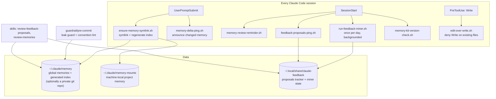
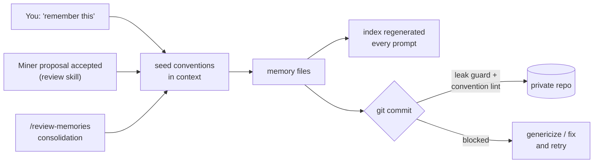
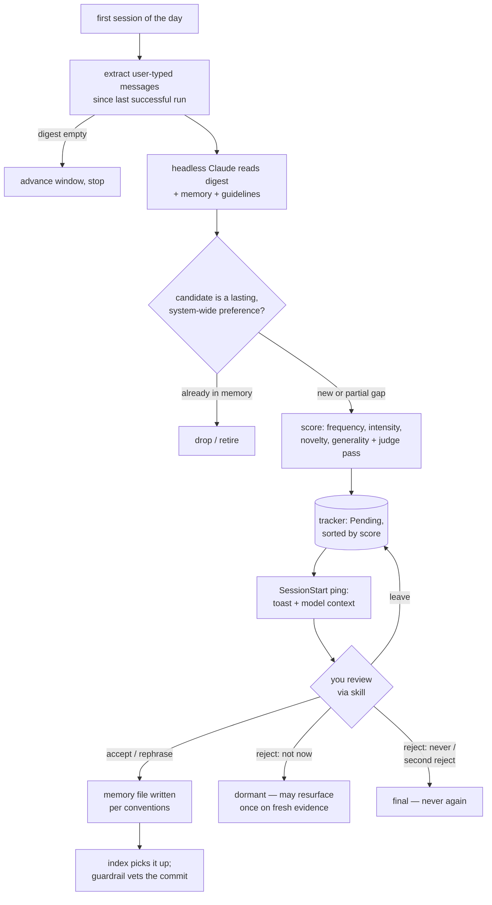
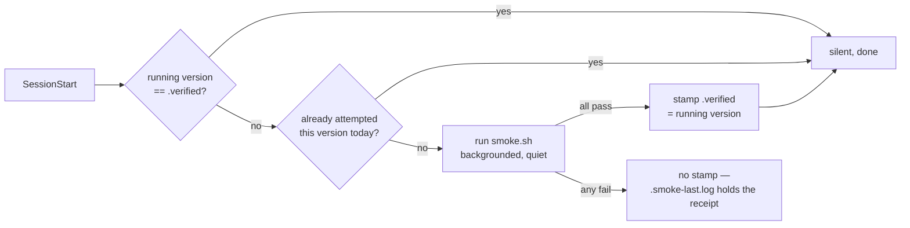

# Design

The decisions that shaped this kit, and the incidents behind them. Without this file
that reasoning would live only in old conversations and commit messages.

## The system at a glance

## Memory

**Two tiers, split by what may leave the machine.** Global memory (`~/.claude/memory`)
holds project-agnostic preferences and syncs across machines. Mount memory
(`~/.claude/memory-mounts`) holds project facts and never syncs. The boundary is a
privacy line first and an architecture second. Everything below it can name projects
and paths. Everything above it must survive being pushed to a personal GitHub repo.

**The index is generated, never edited.** `MEMORY.md`, the file loaded into every
session, is rebuilt from the memory files on every prompt. Early on it was hand-edited,
and twice an entry silently vanished: once to a hook race, once to an automated rewrite.
A derived index cannot drift or lose entries, and any writer that corrupts it is undone
one prompt later.

**Memory files are What, then Why, then How, with no incident evidence inside.** A rule
states the preference, the generalized reason, and when it applies. The incident that
motivated it (quotes, repo names, file paths) stays in the miner tracker and git
history. The first design allowed a masked evidence section. Work-identifying names kept
riding in through that exception faster than they could be masked, so the leak surface
was removed structurally rather than policed.

**Authoring conventions ship as seed memories.** The commit-time lint cannot reach
memory-mounts (no repo there) and cannot shape write-time behavior anywhere. So the
conventions are installed as memory files themselves. They get recalled at the moment a
session writes memory, which is the only moment that matters. This also counteracts the
harness default of kebab-case memory names, which repeatedly broke wikilinks before the
convention was in context.

### Write paths and their gates

## The daily feedback loop

**Started by your first session of the day, not by cron.** Running on session start
guarantees a working environment (auth, PATH). The miner reads "since the last
successful run", so idle days delay mining rather than losing messages. Cron would add
mining on days the machine sits unused, which buys nothing when nothing was said, and
costs a second environment to keep healthy.

**The window only advances on a verified write.** An early version advanced its
extraction window when the headless session exited zero. A session whose only write was
denied also exits zero, and a day of messages would have been skipped. Now the window
moves only after the tracker file is confirmed re-written. Related: the tracker lives
outside `~/.claude` because headless sessions cannot write inside it (sensitive-file
protection). That was discovered when the miner's first-ever write was silently blocked.

**Proposals die slowly, not instantly.** Rejection is two-strike. A rejected proposal
may resurface once, only on fresh evidence spanning several new days. A second
rejection, or an explicit "never", is final. A hard "never re-propose" fossilizes a snap
judgment made on thin evidence; unbounded re-proposal is nagging. One justified re-ask
is the compromise.

**The miner may not write absolutes from one-off remarks.** A single "no need, leave it"
is a judgment about one case, not a standing rule. Turning it into "never do X" is
dangerous precisely when X is a safety or cleanup action. Candidate rules must match the
strength of their evidence, and situational preferences become "ask first", not "never".
The review step caught the miner doing exactly this once, so the phrasing rule moved
upstream into the brief.

**Pings speak to both audiences.** Every notice is emitted twice in one JSON payload:
`systemMessage` for the human (a toast not every UI shows) and `additionalContext` for
the model, so Claude relays it in its first reply. The dual emission exists because the
toast-only version ran silently for weeks in a UI that never displayed it, and proposals
piled up unseen. Repeats are bounded by a once-per-session-per-day marker: resumes and
compactions of the same session stay silent, a new day re-notices (a week-long session
still hears about overdue reviews), and a missing session id fails open to the old
always-notice behavior.

**Review protocols are skills, not file headers.** The accept/reject protocol first
lived in the tracker's header, written once at file creation. After the third protocol
revision, live trackers still carried the first draft. A skill is versioned with the
kit, updated by `install.sh`, and invoked by the natural phrase. Interactive rituals
belong in skills; the miner's headless brief stays a prompt file.

## Guarding

**The guardrail is generic patterns plus a local denylist.** The built-in patterns catch
any home path, any email, and a mount section, so the hook itself carries no identifying
information and can be public. Employer names and other private terms come from an
untracked `denylist.local` or an environment variable. It runs as the memory repo's
pre-commit and enforces both leak-safety and the file conventions. Commit time is the
last moment before content becomes irreversible history.

**Edit-over-Write.** A `PreToolUse` hook denies the `Write` tool on any existing file,
so every change lands as a reviewable diff. Memory used to tell the agent to prefer
Edit. Memory is advisory, and it was eventually ignored. The hook is not advisory.

## Code layout

**One accessor layer (`core/lib.sh`).** Every path into Claude Code internals
(transcript layout, session ids from hook stdin, binary and version discovery) and every
behavior shared by more than one script (notice markers, dual-audience emission, the
GNU/BSD `stat` shim) lives in a single sourceable file. The scripts stay thin. Before
the lib, the same logic existed in two or three slightly different copies (two binary
resolvers, three session-id parsers), and each harness change had to be found and fixed
per script. Functions fail quiet: empty and non-zero, never an error, so a harness
change degrades hooks to "no data" instead of breaking prompts.

## Installing and upgrading

**Deployment is a test-gated whole-tree copy.** The installer runs the fixture suite
first and refuses to deploy a tree the tests reject, so what ships is always a tested
snapshot. It then replaces `~/.claude/memory-kit` as one unit. Scripts, their core lib,
hooks, guardrail, and tests move together, so a script can never run against a stale
sibling. The earlier layout scattered loose script copies into a shared directory, which
drifted from the checkout four separate times during development. Run-in-place (hooks
pointing at the checkout) was considered and rejected: `git pull` would ship an untested
working tree straight into live sessions, where the gate makes that impossible. The
deployed tree also accumulates machine state (`.verified`, the private denylist) that a
redeploy deliberately preserves.

**Upgrades migrate, then merge.** Old-layout hook commands are re-pointed onto the tree
first, matched strictly by our script basenames so other tools' hooks in the same
directories are never touched. Then the normal append-and-dedup merge runs. Finally the
stale legacy copies (exactly ours, nothing else) are removed.

**The settings merge is append-only, deduped per hook, by script filename.** Merging by
deep-merge replaced other tools' hook arrays. Deduping by exact command string broke on
`$HOME` versus absolute-path spellings. Deduping per group (keyed on the group's first
hook) silently dropped any hook later added to an existing group, which meant upgrades
never delivered new hooks to installed machines. Each of those failures is a test now.
Hook script names are kit-prefixed where a collision with a sibling kit's file is
plausible, because the filename is the dedup key.

## Self-verification

**Two suites with opposite premises.** `tests/run.sh` is the gate: fixtures in throwaway
directories, runs everywhere, asserts exact outcomes. It can only confirm what its
author believed the data looks like. `tests/smoke.sh` is the reality check: no fixtures,
real transcripts and settings on the machine at hand, every check an invariant
("whatever the answer is, it must have this shape"), skipping where data does not exist.
Its first two runs caught a real extractor leak (a truncated injected block with no
closing tag) and the group-dedup upgrade bug. Both were invisible to the fixture suite.
Both lived in the gap between belief and disk.

**The version stamp closes the loop.** The kit parses undocumented Claude Code
internals, so a harness update can silently break it. A clean smoke pass stamps the
current Claude Code version into `.verified` (machine-local). A SessionStart hook
compares the stamp to the running version and re-runs the suite when they differ, once
per version per day, in the background. On failure nothing is stamped and the log holds
the receipt: the missing write is the report. A warning that fired on every update,
already-checked or not, would be ignored within a month.

