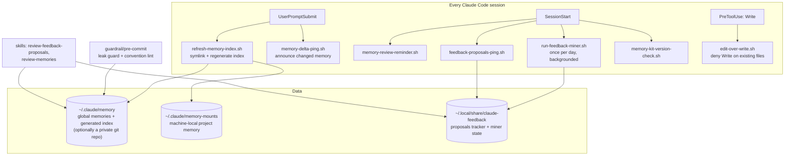
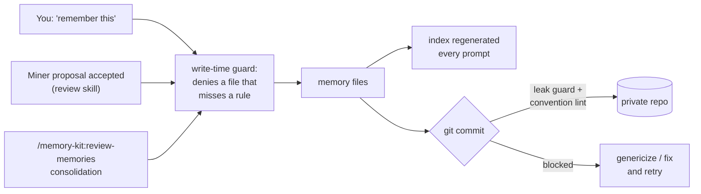
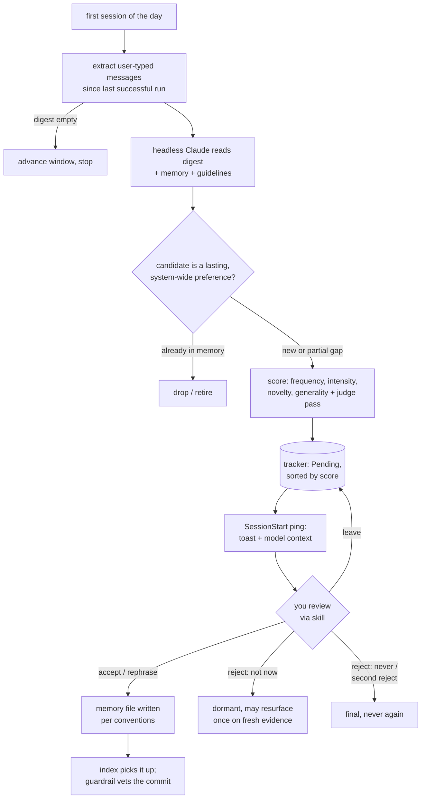

# How the kit behaves

Diagrams of what runs when, plus the specifics [HOW-IT-WORKS.md](HOW-IT-WORKS.md)
deliberately leaves out. The reasons behind each choice live in the five decision records:
[DESIGN-memory.md](DESIGN-memory.md), [DESIGN-miner.md](DESIGN-miner.md),
[DESIGN-guardrail.md](DESIGN-guardrail.md), [DESIGN-install.md](DESIGN-install.md) and
[DESIGN-health.md](DESIGN-health.md). What those decisions rest on, meaning the observed Claude
Code behaviour rather than our choices, is [INTERNALS.md](INTERNALS.md).

One rule keeps this file from growing into a second copy of the plain-language version: a
sentence that also belongs in HOW-IT-WORKS goes there and not here. What lives here is the
diagrams, and the detail a reader has to have asked for.

## Everything that runs in a session

Three hook events carry the whole kit. `UserPromptSubmit` fires on every message, which is
why the index can be rebuilt from disk rather than cached. `SessionStart` carries everything
that speaks to you, plus the miner, which runs once a day and in the background so a slow
run never delays a prompt. `PreToolUse` carries one guard, on `Write` only.

Of the three stores, only `~/.claude/memory` can leave the machine. `memory-mounts` is
machine-local by design, and the tracker sits outside `~/.claude` entirely because a headless
session cannot write inside it.

## Where a memory can come from, and what gates it

Three ways in, one gate out. Every path passes through the same authoring conventions,
because those ship as memory files and are therefore in context at the moment of writing.
The commit gate only exists if you sync; on an unsynced folder the right-hand half of this
diagram never runs.

## The daily loop, and how a proposal ends

The part worth reading twice is the bottom right. Rejection is two-strike, so "not now" and
"never" are different answers: the first leaves a proposal dormant and lets it return once,
and only on fresh evidence spanning new days; the second is final. "Leave" is a third answer
that changes nothing and keeps the proposal pending.

The window advances only after the tracker is confirmed rewritten, which is why an
interrupted run costs you a delay rather than a day of messages.
